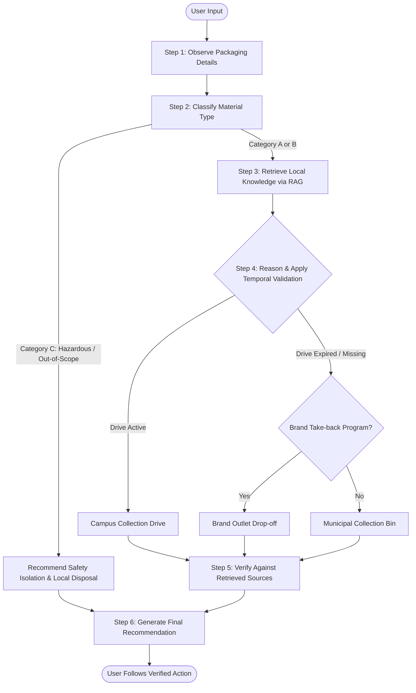

# EcoRoute - Single-Agent Reasoning Workflow

This document explains the Single-Agent Reasoning Workflow and temporal validation checks powering **EcoRoute**.

## Detailed Execution Steps

### 1. Observe Packaging
The system identifies the packaging type from the user's description or upload. It observes attributes such as text markings, foil reflections, material elasticity, and structural seals.

### 2. Classify Material
The system classifies the packaging into one of three distinct categories:
*   **Category A (Difficult-to-recycle)**: Multi-layer plastic, laminated wrappers, sachets, and foil-lined packaging.
*   **Category B (Standard Recyclable)**: Clean PET bottles, paper packaging, and clean cardboard.
*   **Category C (Hazardous or Outside Scope)**: Household hazards like batteries, electronics, chemicals, or medical waste.

### 3. Retrieve Local Knowledge (RAG)
The system searches local knowledge directories (`municipal_waste_guide.json`, `campus_sustainability_guide.json`, and `brand_takeback_directory.json`) for matches matching the observed material, packaging type, and location.

### 4. Reason Through Available Options
EcoRoute evaluates the retrieved programs based on proximity and circularity principles:
1.  **Campus / Community Drives**: Local, highly accessible, and specialized.
2.  **Brand Take-back Programs**: Producer-managed reclamation systems.
3.  **Municipal Collection Points**: Widespread curbside dry-waste sorting.

*Temporal Validation*: During this reasoning step, if a program is marked as `EXPIRED` or its validity date has passed, the system automatically disqualifies it and routes the waste to the next valid option.

### 5. Verify Recommendation
The system cross-checks the draft action against the source documents. It strips out any unverified addresses, schedules, or claims, preventing hallucination.

### 6. Generate Final Recommendation
The system formulates a direct, clear disposal recommendation following the required layout structure.
